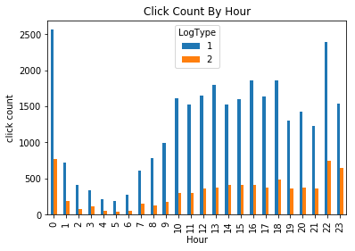
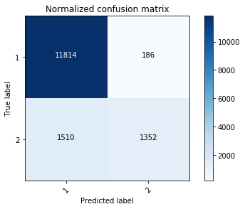

# Predicting User Clicks

This project is the IX Hackathon 2018 idea of the team I was a part of. As a member of the team I worked in performing the analysis on the data and creating the machine learning models. 
Our idea was to predict if a particular user profile would click on a particular advertisement. We made use of predictive machine learning models to do this. 

## Data Used

The project makes use of data from a Chinese DSP, iPinYou. iPinYou makes use of Real-Time Bidding and audience profiling technology. 
In 2013, iPinYou launched an online contest to tune their bidding algorithm. They published their bid request data online for public use for this competition. This data resembles Index's audit logs and contains advertisement properties and user profile information as well, making it perfect for our hackathon idea. The data includes iPinYou's bid requests for three seasons - March, June and October of year 2013. Season 2 (June) and 3 (October) have user profile information. Each season has 7 days of data. 

The data can be found in the data folder of this repo. 

### Training Data

Days 6, 8, 9, 10 and 12 were used as training data.

### Testing Data

Days 7 and 11 were used as testing data.

## Data Download

The full set of data can be found [here](http://data.computational-advertising.org/). Please note that this is a very large file (~6GB). Each additional file within this zip is another large tar (~1GB each). Download only if needed. 

## Meta Data

Meta data for the data set can be found [here](http://contest.ipinyou.com/ipinyou-dataset.pdf). See page 4 of the pdf. 

## Analysis Conducted

The bid requests have a column labelled log type. These are classified as either impressions (1), clicks (2) and conversions (3). Important to note that we changed the conversions to clicks. This is because a conversion will result from a click and allows for a binary classification of the data. 
To determine the feature vectors of the data, we had to perform an analsis on each of the data to determine which feature variables were those that we should add to our feature vector. 



For example in this image above we see how the click counts vary by the hour of day. The clicks stay flat for most of the day, but then peak at 10pm, 11pm and midnight. This probably indicates deals that are ending at midnight. 


Another example is how the click count varies by the size of the ad. As can be seen bigger ads and medium sized ads are clicked more. 

Using this analysis we created a 54-variable feature vector. Once we decided on the vector, we created our training and testing set, as described in the section above. 
Next, we create supervised machine learning models which predicted the probability of a user clicking a particular ad. Three common predictive machine learning algorithms were used: 

1. Logistic Regression
2. Decision Trees
3. Gradient Boosting

We also performed an analysis on our models and determine an accuracy of ~88% for each of them. Finally a confusion matrix was plotted for each of these models. An example of this is show below. 



The elements on the major diagnol represent the true-positives. Where as the others show false-positives (i.e. where it was actually an impression but was predicted as a click). As our impression data was very large, it appears that the model was fitted well for impressions. 

## Veiwing Data Analysis

We used Jupyter Notebooks for exploratory analysis of the data.
You should already have Python3 installed on your Mac. Install the remaining dependencies

```
# install Pandas
python3 -m pip install --upgrade pandas

# install matplotlib
python3 -m pip install matplotlib

# if you want to work with Jupyter notebooks use:
python3 -m pip install jupyter
```

Bring up jupyter notebook web app for an interactive live coding environment. 

```
# in the main folder, run
jupyter notebook
```

This will bring up a Jupyter Notebook which shows the analysis we performed on the data. 

## Possible Improvements

1. More data never hurts...as long as its relevant!
2. Our data was heavy on impressions...models were better fitted for that data.
3. Improving homogeneity of data

